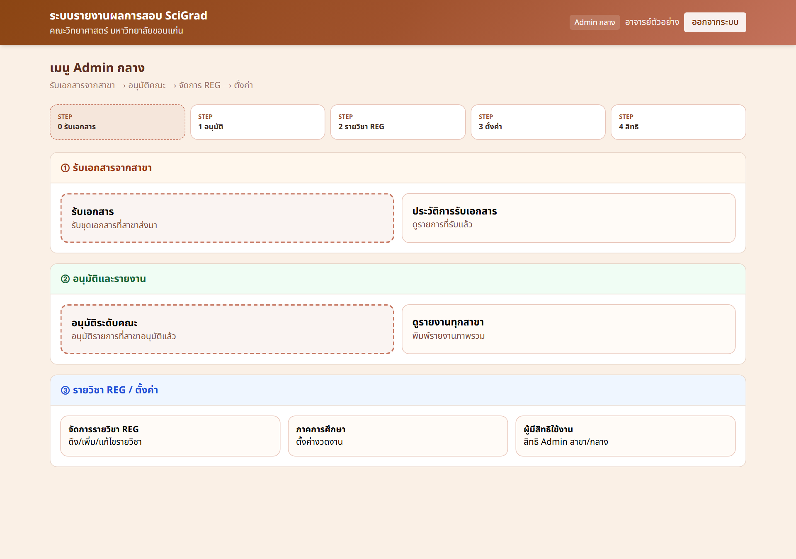

# คู่มือ Admin กลาง (สรุปสั้น)

ระบบรายงานผลการสอบ SciGrade — คณะวิทยาศาสตร์ มหาวิทยาลัยขอนแก่น

## 1) เข้าสู่ระบบ

1. เปิดเว็บไซต์ระบบ
2. กดปุ่ม **เข้าสู่ระบบด้วย Google**
3. ใช้บัญชี `@kku.ac.th`
4. ต้องมีสิทธิ์ Admin กลางในระบบ

*ภาพ: หน้าเข้าสู่ระบบ — กดปุ่ม Google เพื่อเริ่มใช้งาน*

หลังเข้าสู่ระบบ ระบบจะพาไปหน้างาน Admin กลางตามสิทธิ์ที่ได้รับ

## 2) หน้าเมนู Admin กลาง

*ภาพ: เมนู Admin กลาง จัดเป็นขั้น 0→4 ให้ทำงานตามลำดับ*

### อ่านภาพแบบเร็ว

| ขั้น | เมนู | ทำอะไร |
|------|------|--------|
| 0 | รับเอกสาร / ประวัติ | รับชุดเอกสารจากสาขา |
| 1 | อนุมัติระดับคณะ / รายงาน | อนุมัติรายการที่สาขาผ่านแล้ว |
| 2–3 | รายวิชา REG / ตั้งค่า | ดึงรายวิชา ตั้งภาค ปี หลักสูตร |
| 4 | ผู้มีสิทธิใช้งาน | กำหนดสิทธิ Admin สาขา/กลาง |

## 3) ขั้นตอนสั้นๆ

### รับเอกสารจากสาขา

1. เปิดรายการรอรับ
2. ตรวจสาขา ภาค ปี และไฟล์
3. กด **รับเอกสาร**
4. หลังรับแล้ว สาขาจะไม่แก้เอกสารรอบนั้นได้อีก

### อนุมัติระดับคณะ

1. เปิด **อนุมัติระดับคณะ**
2. กรองรายการที่ **สาขาอนุมัติแล้ว**
3. **อนุมัติ** หรือ **ส่งกลับแก้ไข**
4. ใช้อนุมัติหลายรายการได้เมื่อทำงานเป็นชุด

### จัดการรายวิชา REG

1. เปิด **จัดการรายวิชา REG**
2. เลือกภาค / ปี
3. ดึงข้อมูลจาก REG
4. เพิ่ม แก้ไข หรือลบรายวิชาตามต้องการ

## ความหมายสถานะ

| สถานะ | ความหมาย | ฝั่งคณะ |
|-------|----------|---------|
| รออนุมัติ | ยังไม่ผ่านสาขา | โดยทั่วไปยังไม่อนุมัติ |
| สาขาอนุมัติ | พร้อมให้คณะตรวจ | อนุมัติ หรือส่งกลับ |
| คณะอนุมัติ | จบแล้ว | — |
| ส่งกลับแก้ไข | ให้แก้ | รอส่งกลับมาใหม่ |

## ข้อควรจำ

- อนุมัติคณะควรทำกับรายการที่ **สาขาอนุมัติแล้ว**
- การดึง REG อาจใช้เวลา — รอจนระบบแจ้งผล
- ตรวจภาค/ปีให้ตรงก่อนทำงานเป็นชุด

> หมายเหตุภาพ: หน้า login เป็นภาพจากระบบจริง ส่วนหน้าเมนูเป็นตัวอย่าง UI ตามระบบจริง เพื่ออธิบายลำดับงานของ Admin กลาง
