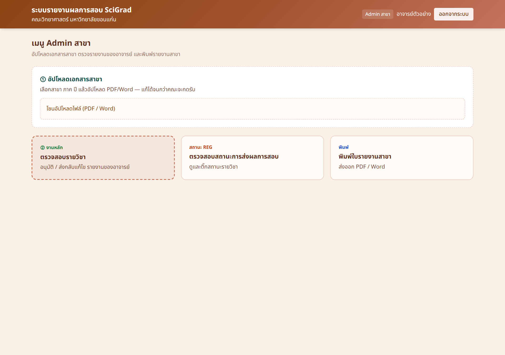

# คู่มือ Admin สาขาวิชา (สรุปสั้น)

ระบบรายงานผลการสอบ SciGrade — คณะวิทยาศาสตร์ มหาวิทยาลัยขอนแก่น

## 1) เข้าสู่ระบบ

1. เปิดเว็บไซต์ระบบ
2. กดปุ่ม **เข้าสู่ระบบด้วย Google**
3. ใช้บัญชี `@kku.ac.th`
4. ต้องมีสิทธิ์ Admin สาขาในระบบ

*ภาพ: หน้าเข้าสู่ระบบ — กดปุ่ม Google เพื่อเริ่มใช้งาน*

หลังเข้าสู่ระบบ ระบบจะพาไปหน้างาน Admin สาขาตามสิทธิ์ที่ได้รับ และเห็นเฉพาะสาขาที่รับผิดชอบ

## 2) หน้าเมนู Admin สาขา

*ภาพ: เมนูหลักของ Admin สาขา — อัปโหลดเอกสาร ตรวจรายวิชา ดูสถานะ REG และพิมพ์รายงาน*

### อ่านภาพแบบเร็ว

| จุดบนหน้าจอ | ความหมาย |
|-------------|----------|
| ① อัปโหลดเอกสารสาขา | ส่งไฟล์เอกสารของสาขาตามภาค–ปี |
| ② ตรวจสอบรายวิชา | อนุมัติหรือส่งกลับรายงานของอาจารย์ |
| สถานะการส่งผลการสอบ | ติดตามรายวิชาจาก REG |
| พิมพ์ใบรายงานสาขา | ส่งออก PDF/Word |

## 3) ขั้นตอนสั้นๆ

### อนุมัติรายงานอาจารย์

1. เปิด **ตรวจสอบรายวิชา**
2. กรองภาค / ปี / สาขา
3. รายการรอสาขา → **อนุมัติ**
4. ถ้าต้องแก้ → **ส่งกลับแก้ไข**
5. เมื่ออาจารย์ส่งการแก้ไขกลับมา → ตรวจอีกครั้ง

### อัปโหลดเอกสารสาขา

1. เลือกสาขา ภาค ปี
2. อัปโหลด PDF/Word
3. แก้/แทนที่ได้จนกว่าคณะจะกดรับเอกสาร

### พิมพ์รายงานสาขา

1. เปิด **พิมพ์ใบรายงานสาขา**
2. เลือกเงื่อนไข
3. ส่งออก PDF หรือ Word

## ความหมายสถานะ

| สถานะ | ความหมาย | ฝั่งสาขา |
|-------|----------|----------|
| รออนุมัติ | อาจารย์ส่งมาแล้ว | อนุมัติ หรือส่งกลับ |
| สาขาอนุมัติ | สาขาผ่านแล้ว | รอคณะ |
| คณะอนุมัติ | คณะผ่านแล้ว | จบ |
| ส่งกลับแก้ไข | ให้อาจารย์แก้ | รอส่งการแก้ไข |

## ข้อควรจำ

- อนุมัติสาขา = เปลี่ยนจาก **รออนุมัติ → สาขาอนุมัติ**
- ตรวจเอกสารให้พร้อมก่อนคณะกดรับ
- ทำงานได้เฉพาะสาขาที่มีสิทธิ์

> หมายเหตุภาพ: หน้า login เป็นภาพจากระบบจริง ส่วนหน้าเมนูเป็นตัวอย่าง UI ตามระบบจริง เพื่อชี้ตำแหน่งงานหลักของสาขา
