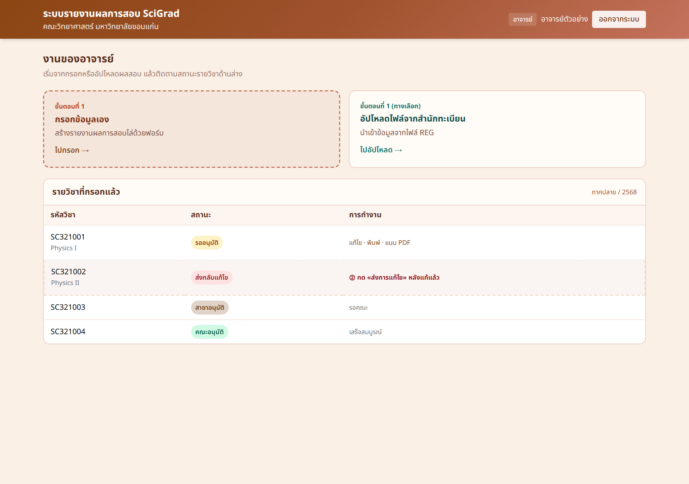

# คู่มืออาจารย์ (สรุปสั้น)

ระบบรายงานผลการสอบ SciGrade — คณะวิทยาศาสตร์ มหาวิทยาลัยขอนแก่น

## 1) เข้าสู่ระบบ

1. เปิดเว็บไซต์ระบบ
2. กดปุ่ม **เข้าสู่ระบบด้วย Google**
3. ใช้บัญชี `@kku.ac.th`
4. ต้องเป็นบุคลากรที่มีในระบบคณะ

*ภาพ: หน้าเข้าสู่ระบบ — กดปุ่ม Google เพื่อเริ่มใช้งาน*

หลังเข้าสู่ระบบ ระบบจะพาไปหน้างานของอาจารย์โดยอัตโนมัติตามสิทธิ์ที่ได้รับ

## 2) หน้างานของอาจารย์

บนหน้าหลักจะมี 2 ทางเริ่มงาน และรายการวิชาที่เคยกรอกแล้ว

*ภาพ: เมนูอาจารย์ — กรอกเอง หรืออัปโหลดจากสำนักทะเบียน แล้วติดตามสถานะด้านล่าง*

### เริ่มสร้างรายงาน

| เมนู | ใช้เมื่อ |
|------|----------|
| กรอกข้อมูลเอง | สร้างรายงานด้วยฟอร์ม |
| อัปโหลดไฟล์จากสำนักทะเบียน | มีไฟล์จาก REG |

### ดูสถานะในตาราง

| สี/สถานะ | แปลว่า | ทำอะไรต่อ |
|----------|--------|-----------|
| รออนุมัติ | ส่งแล้ว รอสาขา | รอ หรือแก้ได้ถ้ายังไม่ล็อก |
| ส่งกลับแก้ไข | ต้องแก้ | แก้แล้วกด **ส่งการแก้ไข** |
| สาขาอนุมัติ | สาขาผ่านแล้ว | รอคณะ |
| คณะอนุมัติ | เสร็จแล้ว | ไม่ต้องทำอะไรเพิ่ม |

## 3) ขั้นตอนสั้นๆ

1. สร้างรายการ (กรอกเอง / อัปโหลด)
2. กรอกผลสอบให้ครบ → พิมพ์รายงาน
3. แนบ PDF ถ้าจำเป็น (เช่น เกรด I / ส่งช้า)
4. รอสาขา–คณะอนุมัติ
5. ถ้าถูกส่งกลับ → แก้ → กด **ส่งการแก้ไข**

## ข้อควรจำ

- แก้ไขได้เมื่อสถานะเป็น **รออนุมัติ** หรือ **ส่งกลับแก้ไข**
- ตรวจภาคและปีการศึกษาให้ถูกก่อนสร้างรายการ
- เข้าสู่ระบบไม่ได้ → ติดต่อผู้ดูแลระบบคณะ

> หมายเหตุภาพ: หน้า login เป็นภาพจับจากระบบจริง ส่วนหน้าเมนูเป็นตัวอย่างหน้าจอตาม UI ของระบบ เพื่ออธิบายตำแหน่งปุ่มและสถานะให้เข้าใจง่าย
